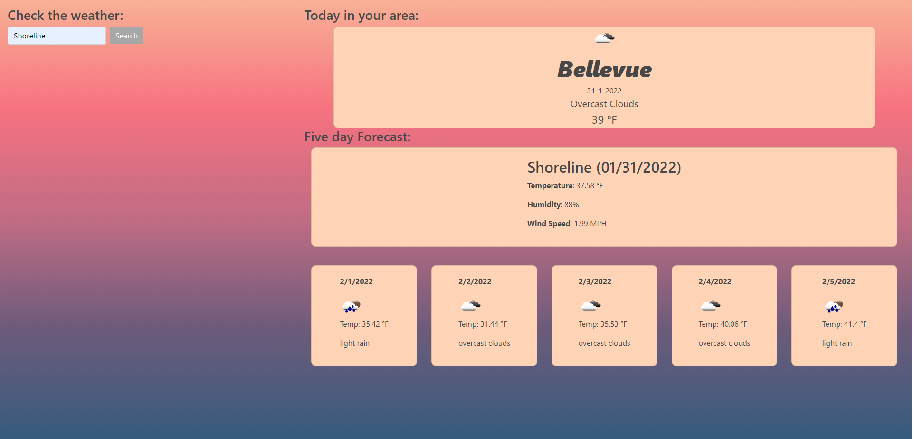

# Weather forcasting

## Description

"A traveler wanted to travel into other locations that are not here, while looking at current weather"

Published at: https://corhydare.github.io/WhatShouldYouDoToday/

Following instructions were given:

```
GIVEN a weather dashboard with form inputs
WHEN I search for a city
THEN I am presented with current and future conditions for that city and that city is added to the search history
WHEN I view current weather conditions for that city
THEN I am presented with the city name, the date, an icon representation of weather conditions, the temperature, the humidity, the wind speed, and the UV index
WHEN I view the UV index
THEN I am presented with a color that indicates whether the conditions are favorable, moderate, or severe
WHEN I view future weather conditions for that city
THEN I am presented with a 5-day forecast that displays the date, an icon representation of weather conditions, the temperature, the wind speed, and the humidity
WHEN I click on a city in the search history
THEN I am again presented with current and future conditions for that city
```

### UVI fetched ferom current location:

```javascript
if (navigator.geolocation) {
    navigator.geolocation.getCurrentPosition((position) => {
      // storing Longitude and Latitude in variables
      lon = position.coords.longitude;
      lat = position.coords.latitude;
      // normal weather and uv index are in separate api's now
      const base = `https://api.openweathermap.org/data/2.5/weather?lat=${lat}&lon=${lon}&appid=${api}&units=imperial`;
      const uviD = `https://api.openweathermap.org/data/2.5/onecall?lat=${lat}&lon=${lon}&exclude=hourly,daily&appid=${api}`;
      // using fetch to get UVI data
      fetch(uviD)
        .then((response) => {
          // log to find uvi data
          return response.json();
        })
        .then((data) => {
          const { uvi } = data.current;
          uviT.textContent = `UV index: ${uvi}`;
        });
```

### it was nice for weather api to include icon names

```javascript
.then((data) => {
const iconUrl = `http://openweathermap.org/img/w/${icon}.png`;}
```

## Styling

getting nice gradient background and warm colors:

### text area cleaning

```css
body {
  overflow-x: hidden;
  color: #474747;
  background-repeat: no-repeat;
  background-attachment: fixed;
  background-image: linear-gradient(
    #f8b195,
    #f67280,
    #c06c84,
    #6c5b7b,
    #355c7d
  );
}
```

### using the same palletes of colors

```css
.container {
  display: flex;
  align-items: center;
  justify-content: center;
  flex-direction: column;
  background: #ffd3b5;
  border-radius: 10px;
  color: #474747;
}
```

## App



## Conclusion

Things are starting to make more and more sense. I'm content.
